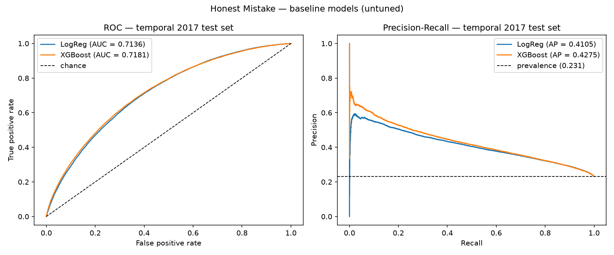
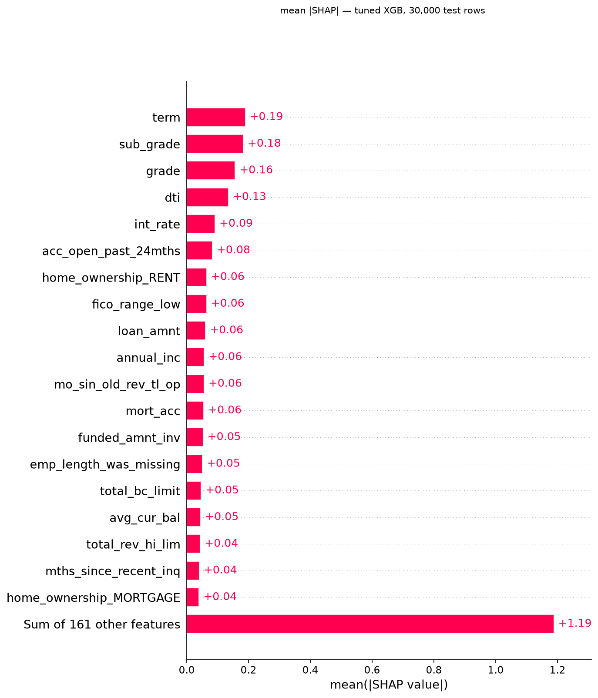
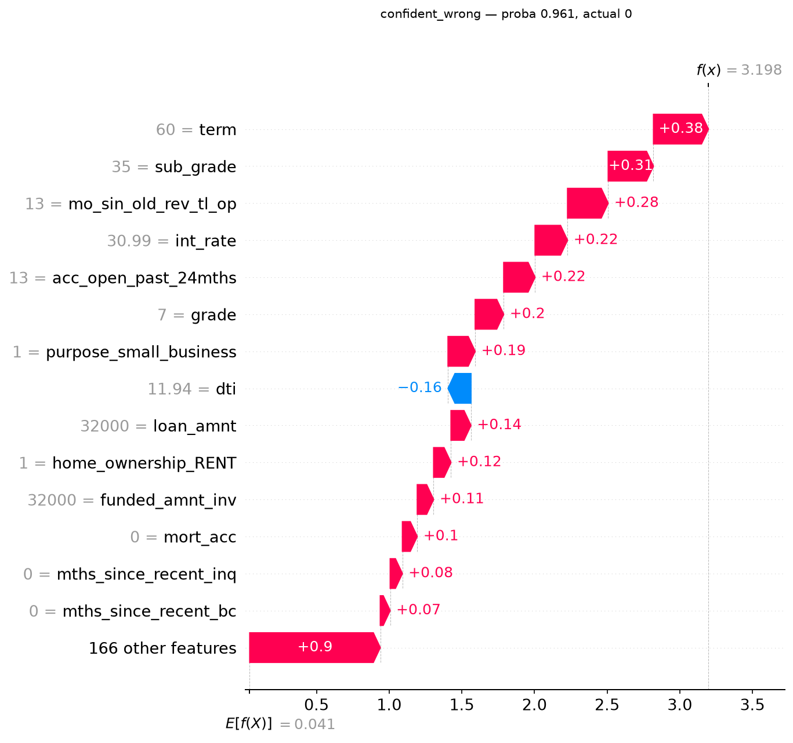
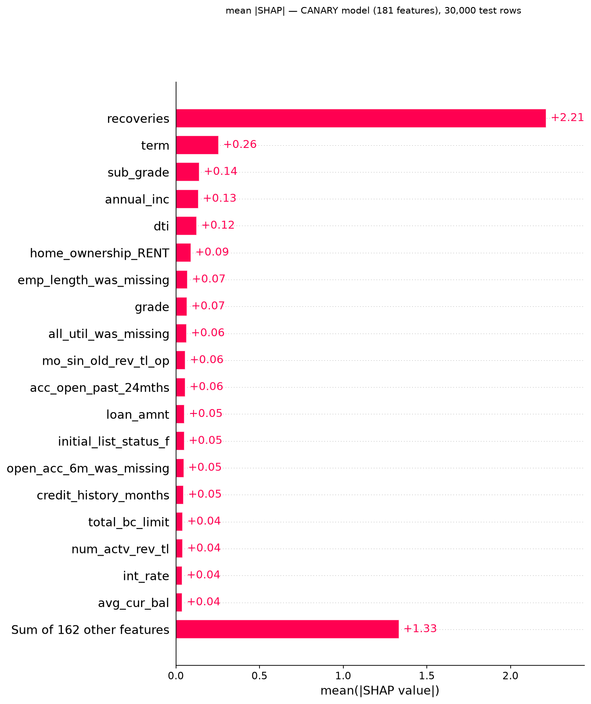

# Honest Mistake

A credit-default model built the honest way, and an agent that tries to catch it cheating.

Most public models on the Lending Club data report AUCs above 0.90. Almost all of them are wrong: they train on columns that only exist *after* a loan's outcome is known, so the model is quietly reading the answer off the back of the page. This project does the opposite. It strips out every post-outcome column, keeps only what a lender would have at the moment of decision, and lands at **ROC-AUC 0.7296** on a true future-year holdout. That lower number is the point.

Then it goes a step further. A second layer hands an autonomous agent five read-only tools and asks it to audit the finished model, without ever telling it what to look for. Five live runs, a planted canary, and an ablation that failed for a reason worth reporting.

The name is deliberate. *Mistake* is the hidden leakage a model carries. *Honest* is the discipline of surfacing it instead of hiding behind a flattering metric — including when the honest result is a zero.

---

## Layer 1: the model

### The data

Lending Club accepted loans, 2007–2018 (`accepted_2007_to_2018Q4.csv`, ~1.68 GB, kept read-only).

| Step | Rows |
|---|---|
| Raw | 2,260,701 |
| Resolved loans only (Fully Paid / Charged Off) | 1,345,310 |
| Issued 2014–2017 | 1,061,042 |

`Current` and other in-progress statuses are dropped: an unresolved loan has no label to learn from. The final set is **1,061,042 loans at a 21.14% default rate**. The 2014–2017 window is chosen deliberately — earlier vintages sit inside the 2008 crisis, and by the data's Dec-2018 cutoff these years have largely matured.

Target: `is_default`, 1 for Charged Off, 0 for Fully Paid.

### The leakage problem

A feature leaks if it would not exist at the moment you make the prediction. `total_pymnt` (how much the borrower has repaid) is the outcome wearing a disguise: high for paid loans, low for defaults. Train on it and you get a beautiful, useless model.

**41 columns** came out, and it took three passes to catch them all:

- **Pattern matching (33 columns).** Payment totals, recoveries, refreshed FICO scores, the whole hardship and settlement family — anything matching a known post-loan naming pattern.
- **Reading the data dictionary (4 columns).** `last_credit_pull_d`, `payment_plan_start_date`, `deferral_term`, and `pymnt_plan` are all post-origination, but their names match no obvious pattern. Automation misses these; a human reading each column's meaning does not.
- **Missingness analysis (1 column).** `orig_projected_additional_accrued_interest` survived both earlier passes. It is almost entirely missing because it only exists for borrowers already on a hardship plan — a leak that shows itself only when you ask *why* a column is empty.

Every dropped column is logged with a one-line reason in `outputs/leakage_drop_log.txt`. Those 41 columns are also the ground truth Layer 2 was later built to rediscover from scratch.

### Evaluation

The split is **temporal, never random**: train on 2014–2016, test on 2017. A random split would let the model train on 2017 loans and test on 2014 ones, learning from the future to predict the past. That never happens in deployment, and it quietly inflates every metric.

Default rates rise across vintages (18.45% → 20.18% → 23.28% → 23.12%), so the 2017 test set is genuinely harder than training. That is the same drift a deployed model faces.

The 2017 test set is scored **exactly once**, at the very end. Tuning runs against a 2016 validation year carved out of training data, so the test set stays untouched until the final number.

Accuracy is never used. At a 21% default rate, a model that predicts "no default" for everyone scores 79% accuracy while catching zero defaulters. Reported instead: **ROC-AUC** for ranking quality, **PR-AUC** for the minority class that actually matters.

### Results

All on the 2017 temporal test set.

| Model | ROC-AUC | PR-AUC | Brier |
|---|---|---|---|
| Logistic Regression (reference) | 0.7136 | 0.4105 | 0.2259 |
| XGBoost (baseline) | 0.7181 | 0.4275 | 0.2139 |
| XGBoost (tuned) | **0.7296** | **0.4404** | 0.2173 |



*Baseline models only — Logistic Regression and untuned XGBoost. The tuned model is not plotted here.*

PR-AUC against a prevalence floor of 0.2312: the tuned model roughly doubles what random ranking gives on the class that counts.

Two things worth more than the headline number:

**The tuned model generalises cleanly.** Validation AUC on 2016 was 0.72732; test AUC on 2017 was 0.7296. A gap of −0.0023. The tuning did not memorise the validation year.

**0.73 is the honest ceiling here.** Origination-only information on this data tops out in the low 0.70s. If I had seen 0.85+, my first move would have been to hunt for the leak that survived, not to celebrate. Layer 2 later put that instinct to the test directly.

Tuning was 50 Optuna trials (TPE, seed 42, 17.2 minutes). Best trial #21: depth 8, learning rate 0.019, 900 trees, 50% row subsampling. Regularisation done by sampling rather than explicit penalties.

### The audit

`07_audit.py` interrogates the trained model with SHAP and a set of rule-based honesty checks.



**What carries the model.** `term`, `sub_grade`, `grade`, `dti`, `int_rate` lead, and eight of the top ten slots are core credit variables. Every direction makes sense: longer terms, worse grades, higher DTI, higher rates and lower FICO all push risk up. Nothing with a leakage signature appears.

**Three flags, three different verdicts.** The rule flags anything unexpected with high attribution; the judgment is mine.

- `home_ownership_RENT` (rank 7). Flagged, benign. Renters defaulting more often is real borrower economics, not an artifact.
- `emp_length_was_missing` (rank 14). A genuine finding, and one I followed up. Applicants who do not state their employment length are measurably riskier, so the model uses "declined to answer" as a risk signal, which raises a fairness question. Dropping it and retraining costs **0.0003 ROC-AUC** (`08_fairness_ablation.py`). The model does not depend on it, so it can go for fairness at essentially no cost. Also a case where SHAP overstates importance: rank 14, yet almost fully substitutable by correlated signals.
- The bureau `_was_missing` flags. Layer 1 recorded these as dead weight at test time — Lending Club collected the underlying fields for everyone by 2017, so the flagged cohort should be empty. That was true of the column I checked and false of the family. Eleven of the twenty-two flags are constant zero in the 2017 test set; the other eleven fire, including `il_util_was_missing` at 13.5% of rows and `mths_since_last_record_was_missing` at 80.5%. The original figure was wrong in both its count and its claim, and is corrected in `outputs/audit_notes.txt` with the original text preserved. Layer 2 later turned these same flags into a deliberate trap, and the agent walked into it twice.

**No slice failures.** AUC holds at 0.7268–0.7334 across all four 2017 quarters. Within-grade AUC is lower (0.629–0.706), which is expected: grade already does much of the ranking, so residual signal inside a single grade is naturally smaller.

**The most confident mistake is instructive.**



The model's most confident false positive was a G5, 60-month, 31%-interest small-business loan from a renter with a 13-month credit file. Scored 0.96. It paid off. The model was not wrong to call that risky — grade G loans default 50.8% of the time. That is irreducible uncertainty, not a bug, and separating the two is exactly what an audit is for.

---

## Layer 2: the agent

The audit above is mine. I knew where the leaks were, because I removed them. That makes it a demonstration, not a test.

Layer 2 is the test. An agent gets five read-only tools and the trained model, and is asked to report anything that would make the held-out number misleading. **It is never told what to look for.**

### The constraint that makes it real

The easy version of this project tells the agent to find target leakage, watches it find target leakage, and reports high recall. That result belongs to whoever wrote the prompt.

So the system prompt contains no mention of leakage, of timing, of when a field is populated, or of anything having been removed during data preparation. A self-check greps the prompt for seventeen steering terms and all 224 documented column names, and fails the build if any appear. Even a column name in a code comment fails it, because the next person editing the prompt would read it.

The agent gets the modelling task, five tools, a budget, and a required output format. Where it goes from there is its own.

### What happened

Two full runs against the real model. Both completed, both stopped on their own budget, both produced correctly formatted answers.

**Neither found any leakage. Recall 0.0.**

That is not the agent failing. Every leaking column had already been removed in Layer 1. They are not inputs to the model it was auditing.

In one run the agent looked up `loan_status`, identified it as the likely source of the default label, reasoned about it, checked whether the model reads it, found it does not, and moved on without flagging it. That is the correct call. A column the model cannot see is not a route by which it sees the answer.

What it flagged instead were distribution problems: two features that are near-constant in the 2017 window, and an argument about outcome maturity — that 60-month loans in the holdout may not have revealed their final status yet, so the model's most influential feature could be learning a distorted relationship. Those are real concerns about whether the held-out number means what it appears to mean. They are just not the concern the answer key scores.

So the zero says something about the ground truth, not only about the agent. That mismatch is recorded as unresolved in `EVAL_NOTES.md` rather than papered over.

### The canary

That left one question open: can it detect leakage at all?

I put `recoveries` back into the feature matrix — a column whose value is set only after a loan has already charged off — retrained with identical parameters and seed, and ran the agent again.

| | ROC-AUC | PR-AUC |
|---|---|---|
| Layer 1 model (180 features) | 0.7296 | 0.4404 |
| Canary model (181 features) | **0.8730** | **0.8017** |

The choice was measured, not assumed. `out_prncp` and `hardship_flag` look like obvious leaks on paper but are constant in the resolved 2014–2017 subset, so either would have been a null canary leaking nothing. `recoveries` fires on two thirds of defaults with probability 1.0 — genuinely leaking, but not so overwhelming the problem becomes trivial.



One long bar and nineteen short ones. `recoveries` takes 44.6% of total attribution, 8.7× the next feature. `int_rate` — rank 5 in the honest model — falls to rank 18 here. That is what leakage does: it does not just add signal, it crowds out the real one.

**Caught. 13 tool calls, 6 turns, high confidence, zero false positives.** The earlier runs had each taken around 50 calls and 16 turns. Its stated reason cited three independent routes: the field's description, its SHAP rank, and the ablation delta.

`recoveries` is the loudest possible case, and that limit belongs in the result. A catch here establishes that detection works when the leak is a model input and signalled three ways at once. It says nothing about a subtle one.

### An ablation that failed, and why that is in the record

The plan was to measure how much the agent depended on the data dictionary's timing field by suppressing it and re-running.

Before running it, I scanned every true positive's description. **Thirty-six of thirty-nine carry lifecycle wording in the description itself.** `recoveries` is defined as money recovered after charge-off. `hardship_amount` as interest owed while a hardship plan is in effect. Suppressing one uniform field removes almost nothing.

I could have reworded the dictionary to make the ablation look clean. A description of `hardship_amount` that omits the hardship plan would be false, not neutral. So the dictionary stayed accurate and the ablation ran knowing what it would show.

It showed nothing. Same two flags, same zero recall, 50 calls against 52. The finding is that on this dataset, leakage detection cannot be cleanly separated from reading definitions, because timing is intrinsic to what these fields *are*.

### What the evaluation caught about itself

**The scorer had a blind spot.** Each of the 14 hard negatives has a `_was_missing` twin in the feature matrix, so the trap was 28 columns wide while the scorer could see 14. The agent flagged two derivatives; they scored as unremarkable false positives, and the report read as two ordinary errors rather than the discriminating case hit twice.

The gap was one-directional — it could only ever undercount false positives, never inflate recall — because true positives were removed before feature preparation ran and so have no derivatives at all. That property is now asserted in the answer key's self-check, so it fails loudly if a future change breaks it.

**Two paid runs were lost to a token ceiling set too low.** Both are in the register with the reason they were excluded. A register showing one successful run and nothing else would misrepresent what this took.

### Run register

| Run | Config | Matrix | Result | Flags | TP | FP | Canary |
|---|---|---|---|---|---|---|---|
| run3 | populated included | 180 | completed, 16 turns / 52 calls | 2 | 0 | 2 | — |
| run4 | populated suppressed | 180 | completed, 16 turns / 50 calls | 3 | 0 | 3 | — |
| run5 | populated included | 181 | completed, 6 turns / 13 calls | 1 | 1 | 0 | **caught** |

Three earlier runs terminated as truncated or limit-hit and are not results. They are listed in `EVAL_NOTES.md` with their reasons.

Recall is not comparable across matrices: the denominator is 39 true positives in every row, but none is present in run3/run4's matrix and exactly one is present in run5's.

### Design decisions worth naming

**The agent cannot read the answer.** No file-read tool, no shell, no directory listing, no code execution. Five tools, each bound to one known artefact. `outputs/leakage_drop_log.txt` holds the ground truth and is unreachable — verified by a runtime audit hook that recorded 460 file opens across a full exercise and confirmed none touched it.

**The ground truth was written before the agent existed.** Deliberately. If the agent had come first, I would have read its output and then written a key that happened to match it.

**Not every stop is a finish.** A turn cut off at the token limit and a turn that ends normally both carry zero tool calls. The loop distinguishes them, and anything that is not a clean `end_turn` is marked unusable and refused by the scorer. That guard caught a real truncated run that would otherwise have scored as an answer.

**Reasons are not graded automatically.** Whether a correct flag came from sound reasoning cannot be settled mechanically, so the scorer prints each flag with its stated reason and marks the column ungraded.

**Mock and real runs cannot be confused.** Mode is stamped in the directory name, the manifest, and the first line of every artefact. The scorer refuses to score a mock run even when it parses cleanly.

### Verify it yourself

Every run directory is committed, transcripts and thinking summaries included. The scorer runs on a fresh clone with no regeneration and no API key:

```bash
python -m agent.eval_canary --run outputs/agent_runs/<run_directory>
python -m agent.eval_canary --compare <run3_dir> <run4_dir>
```

Every number in `EVAL_NOTES.md` can be re-derived from what is in the repository.

---

## Pipeline

Each script writes a plain-text notes file to `outputs/`, so the reasoning trail exists on disk rather than only in my head.

**Layer 1**

| Script | Does |
|---|---|
| `01_data_exploration.py` | First look; flags leakage suspects |
| `02_build_dataset.py` | Filters to 2014–2017 resolved loans, drops the 41 columns |
| `03_split.py` | Temporal train/test split by issue year |
| `04_features.py` | Feature prep, all transforms fit on train only |
| `05_baseline.py` | Logistic Regression + untuned XGBoost, to set the bar |
| `06_tune.py` | Optuna tuning against a 2016 validation year |
| `07_audit.py` | SHAP explanations + rule-based honesty checks |
| `08_fairness_ablation.py` | Cost of dropping a fairness-sensitive feature |

**Layer 2**

| Module | Does |
|---|---|
| `precompute.py` | Caches SHAP and drop-one ablations so the agent never recomputes at runtime |
| `data_dictionary.py` | 224 documented columns; the agent's only route to what a field means |
| `tools.py` | The five tools, the ablation switch, and the call log |
| `prompts.py` | System prompt and answer format, with the steering-term self-check |
| `agent.py` | The ReAct loop, budgets, and termination classification |
| `run_audit.py` | Runner, mode stamping, and run artefacts |
| `answer_key.py` | Ground truth and scorer, written before the agent existed |
| `eval_canary.py` | Parsing, scoring, and run comparison |
| `plant_canary.py` | Builds the 181-feature canary matrix and model |

## Known limitations

Stated plainly, because hiding them would defeat the purpose.

- **Resolution bias in the 2017 test set.** The data ends Dec 2018, so a 36-month loan issued in mid-2017 could only resolve that early by prepaying or defaulting fast. The 2017 resolved subset over-represents both, and its 23.12% default rate is not the true vintage rate. 2014–2015 are fully matured and unaffected; 2016 is mildly affected. The agent independently raised a version of this in run4 without being pointed at it.
- **Probabilities are not calibrated.** Class weighting shifts predicted probabilities upward to favour recall, which inflates the Brier score by construction. Ranking metrics are unaffected. Calibration is not addressed anywhere in this repository.
- **The canary establishes a floor, not a ceiling.** Tier A detection only. Nothing here shows the agent would catch a leak without a descriptive giveaway.
- **The timing ablation cannot answer its own question** on this dictionary, for the reason given above.
- **This is a research pipeline, not a service.** Single scripts, no packaging or tests beyond each module's self-check.

## Reproducing

```bash
python3.11 -m venv .venv
source .venv/bin/activate
pip install -r requirements.txt
```

The dataset is gitignored. Download `accepted_2007_to_2018Q4.csv.gz` from the [Lending Club dataset on Kaggle](https://www.kaggle.com/datasets/wordsforthewise/lending-club/data?select=accepted_2007_to_2018Q4.csv.gz), unzip, and place it at `data/raw/`.

Then, in order:

```bash
python src/02_build_dataset.py        # ~1 min
python src/03_split.py                # seconds
python src/04_features.py             # ~1 min
python src/06_tune.py                 # ~18 min
python -m agent.precompute            # ~13 min
python -m agent.plant_canary          # ~2 min
python -m agent.precompute --canary   # ~13 min
```

Roughly 50 minutes after the download, dominated by the tuning study and the two SHAP passes. Tuning is seeded, so the 0.7296 baseline should reproduce exactly.

A live agent run additionally needs `ANTHROPIC_API_KEY` in `.env`. Scoring the committed runs does not.

Built with Python 3.11, pandas, scikit-learn, XGBoost, SHAP, Optuna, and the Anthropic API.
