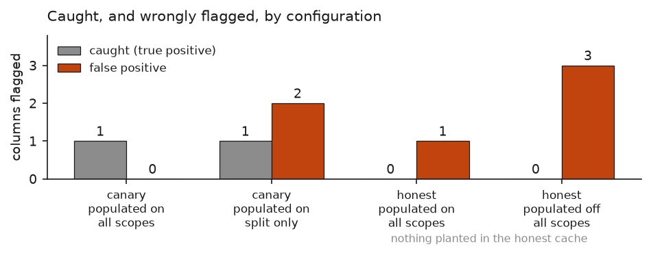
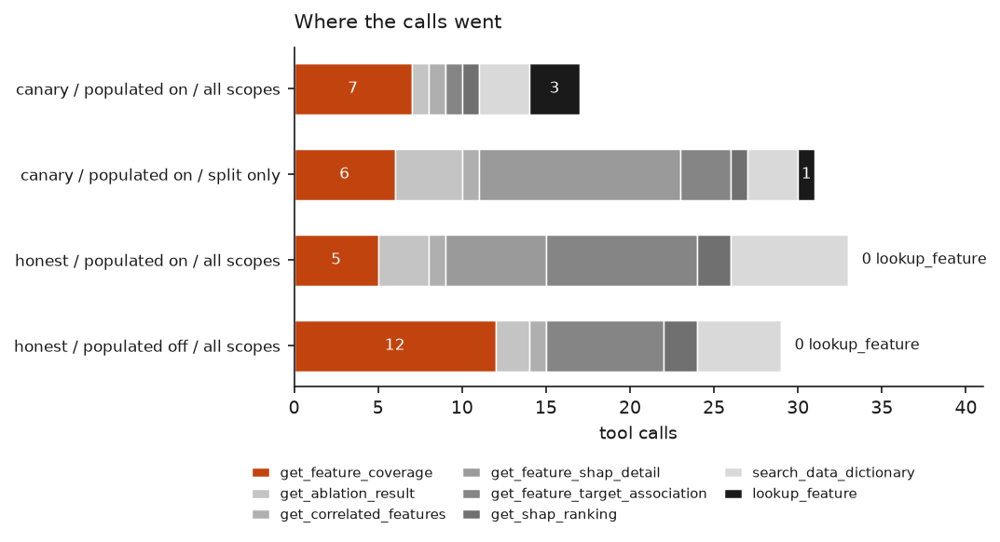

# Layer 2 evaluation

Across four scored runs the planted column was caught in every canary configuration. What changed between configurations was the number of false positives, not whether the leak was found.

This document reports what the agent concluded, and whether it was right. How it got there, meaning its turns, tool calls, rejected and repeated calls, and whether its cited evidence traces back to tool output, is measured in [LAYER2_TRAJECTORY.md](LAYER2_TRAJECTORY.md). The Layer 3 machinery that will validate a tool before an agent may use it, which does not measure the agent at all, is reported in [LAYER3_PHASE3.md](../layer3/LAYER3_PHASE3.md).

## What was tested

Two caches and two switches.

The **canary cache** is the Layer 1 model refitted with `recoveries` added back to the feature matrix. That column is only written once a loan has been charged off, so it carries the outcome. It takes held-out ROC-AUC from 0.7296 to 0.8730. It is the thing the agent is supposed to find, and its presence is the only difference from the honest artefacts.

The **honest cache** is the Layer 1 model as built, 180 features, nothing planted. Any column the agent flags there is wrong. This is the false-positive test.

**`include_populated`** governs the data dictionary. Each entry has a `description`, a `populated` field saying when the column receives its value, and a `source`. With the switch off, `populated` is dropped from every entry `lookup_feature` and `search_data_dictionary` return. The column's definition stays; when in its life it gets filled in disappears. Lifecycle information then has to be reconstructed from measurements rather than read.

**`include_vintage_scopes`** governs per-vintage measurements. With it off, `get_feature_coverage` returns only the train and test scopes, dropping 2014, 2015, 2016 and 2017, and `get_feature_target_association` drops `auc_2014`, `auc_2015` and `auc_2016`. The keys are absent, not blanked. No note says anything was withheld, because a note would tell the agent the figures exist.

Both switches are constructor arguments on the tool layer. Neither appears in any published tool schema, and `dispatch()` rejects either as a tool argument, so the agent cannot read or set them.

## Results

All runs on the eight-tool pgvector surface, `claude-sonnet-5`, 20 turns / 70 calls except where noted.

| run | cache | populated | scopes | turns | calls | cost | termination | flags | TP | FP | precision | recall | f1 | hard negs |
|---|---|---|---|---|---|---|---|---|---|---|---|---|---|---|
| 1 | canary | on | all | 6 | 17 | $0.11 | completed | 1 | 1 | 0 | 1.000 | 0.0256 | 0.050 | 0 |
| 3 | canary | on | split only | 13 | 31 | $0.47 | completed | 3 | 1 | 2 | 0.333 | 0.0256 | 0.048 | 2 |
| 2 | honest | on | all | 14 | 33 | $0.80 | completed | 1 | 0 | 1 | 0.000 | 0.000 | 0.000 | 0 |
| 4 | honest | off | all | 20 | 43 | $1.22 | **turn_limit, unusable** | none | n/a | n/a | n/a | n/a | n/a | n/a |
| 5 | honest | off | all | 12 | 29 | $0.78 | completed | 3 | 0 | 3 | 0.000 | 0.000 | 0.000 | 2 |

Run 4 ran to the turn ceiling at 20 of 20 with 43 of 70 calls used and never produced a findings block. `eval_canary` refuses to score it. It cost $1.22, the most of any run in the project. Run 5 is the same configuration at a 30-turn ceiling.

For context, the same two honest-cache configurations on the earlier five-tool keyword surface: populated on, 16 turns, 52 calls, $0.96, two false positives; populated off, 16 turns, 50 calls, $0.92, three false positives. Both scored 0.000 on precision, recall and f1.

## Findings

**The canary was caught in every configuration, at high confidence, including with the per-vintage view withheld.** Three canary runs across two tool surfaces: the five-tool keyword surface, the eight-tool surface, and the eight-tool surface with `include_vintage_scopes` off. All three flagged `recoveries` first and marked it high confidence. The split-only run's evidence rests on the dictionary entry, a 44.6% share of total absolute SHAP, and the ablation delta from 0.8730 to 0.7296. None of that is a per-vintage figure. Detection did not need the annual breakdown.

**False positives moved; detection did not.** Zero on run 1, two on run 3, three on run 5. Run 1 flagged only `recoveries`. Run 3 added `open_acc_6m_was_missing` and `all_util_was_missing`, both hard negatives. Run 5 flagged three columns and caught nothing, because there was nothing to catch.

The pattern is not a clean ordering by switch setting. Run 5 has the full per-vintage view and produced three false positives, more than the split-only run. Configuration alone does not predict the count.

**Suppressing `populated` had no measurable effect on the score, on either surface.** Five-tool: two false positives with it on, three with it off, precision 0.000 and recall 0.000 both ways. Eight-tool: one with it on, three with it off, precision 0.000 and recall 0.000 both ways. The prediction made before the first ablation, that description text leaks enough lifecycle information to make the field redundant, held on the expanded surface.

That result is weaker than it looks. On the honest cache the score cannot move. Recall is structurally zero there, and precision is zero whenever anything at all is flagged. The scoring matrix has no way to distinguish these two configurations, so "no effect on the score" is close to a statement about the metric. The false-positive count did move, by one on the five-tool surface and by two on the eight-tool surface, in the same direction both times.

**The expanded surface did not improve the honest-cache score.** Every scored honest-cache run in the project sits at precision 0.000, recall 0.000, f1 0.000. Four runs, two tool surfaces, both switch settings. False positives fell from two and three on the five-tool surface to one on the eight-tool surface with `populated` on, which is the only comparison where the count improved.

**Runs 4 and 5 are the same configuration and behaved differently.** Run 4 was cut off at turn 20 having made 43 calls, 23 of them to `get_feature_coverage`. Run 5 finished at turn 12 having made 29 calls, 12 of them to `get_feature_coverage`.

I raised the ceiling from 20 to 30 on the hypothesis that this configuration structurally needed more turns. My reasoning was that with `populated` suppressed, lifecycle information is no longer available in one dictionary call and has to be reconstructed column by column, so the turn budget would bind before the call budget. Run 5 disproved it. It never used the extra room. It finished eight turns below the ceiling that had stopped run 4, on the same cache with the same switches against the same model. The difference between the two runs is variance, and my explanation for run 4 was wrong.

`lookup_feature` was called zero times in both suppressed runs. It was also called zero times in run 2, which had `populated` on, so this is not a consequence of suppression.

## Limitations

**Recall of 0.0256 is not a capability score.** The scoring matrix holds 39 columns. Exactly one of them, `recoveries`, exists in the canary feature matrix; the other 38 are documented in the dictionary but were removed during dataset construction and are not model inputs. The agent is asked whether the held-out figure can be trusted, and a column the model never reads cannot make it untrustworthy. So 38 of the 39 are unflaggable by construction, and 1/39 = 0.0256 is the ceiling on any canary run that finds the planted column. On the honest cache none of the 39 is in the matrix, so recall there can only ever be 0.000. Read the recall column as "found the planted column, yes or no", nothing more.

**One planted column, and an easy one.** `recoveries` has a dictionary entry that says it is set after charge-off, 44.6% of total absolute SHAP, and an ablation delta of 0.1434. Three independent signals all point the same way. A leak that showed up in only one of them, or in none of the precomputed artefacts, is not tested here at all.

**Every honest-cache run produced at least one false positive.** Four scored runs, four surfaces and switch settings, minimum one wrong flag. The best case is one, not zero.

**`term` was flagged by two independent runs, on different evidence, and is a false positive in both.** Run 4-ablated on the five-tool surface reached it through `loan_status` carrying a non-terminal "Current" state, arguing that 2017 loans may not have revealed their final outcome. Run 2 on the eight-tool surface reached it through per-vintage univariate AUC, reporting `term` falling from 0.614 and 0.624 in 2014 and 2015 to 0.576 and 0.566 in 2016 and test, against `installment` moving the other way. Both arguments are about censoring, and neither is about leakage. `term` is recorded at origination, is available before the outcome, and is in `HARD_NEGATIVES`. The scorer counts it wrong because the question is whether a column makes the held-out figure misleading through leakage, and a censoring argument does not establish that. Two runs converging on it from different directions is worth knowing when reading any single run's flags.

**Four scored runs is a small sample.** Runs 4 and 5 show what the variance looks like: same configuration, one cut off at a ceiling and one finishing with eight turns to spare.

**Conceptual retrieval is the weak family**, at 0.287 recall@10 against 0.412 for paraphrase. Questions about where a value comes from or when it is set do worst, which is close to what this audit is about. The numbers and the probe set are in [RETRIEVAL_EVAL.md](RETRIEVAL_EVAL.md).

## Reproducing

Figures: `.venv/bin/python scripts/plot_layer2_eval.py`. It reads the run records under `outputs/agent_runs/`, scores them through `agent.eval_canary.evaluate()`, and stops rather than guessing if a record is missing or unscoreable. No number in either figure is typed in.

Scores: `.venv/bin/python -m agent.eval_canary --run <run directory>`.
